GIT CONFIGURATION COMMANDS
| ACTION | SYNTAX | PURPOSE |
| ------------------------------ | ------------------------------------------------------------ | -------------------------------------------- |
| **Set Configuration Value** | `git config [--local \| --global \| --system] <key> <value>` | Set/save a configuration value |
| **View Configuration Value** | `git config <key>` | View/display a specific configuration value |
| **List All Configurations** | `git config --list` | Display all configuration settings |
| **Remove Configuration Value** | `git config --unset <key>` | Remove/delete a specific configuration value |
| **Remove All Values of a Key** | `git config --unset-all <key>` | Remove all values associated with a key |

REPOSITORY SETUP COMMANDS
| COMMAND | SYNTAX | PURPOSE |
| ---------------------- | --------------------------------------------------- | ------------------------------------------------- |
| **GIT INIT** | `git init` | Create a new Git repository |
| **GIT CLONE** | `git clone <repository-url>` | Copy an existing remote repository |
| **GIT CLONE --BRANCH** | `git clone --branch <branch-name> <repository-url>` | Clone a specific branch |
| **GIT CLONE --DEPTH** | `git clone --depth <number> <repository-url>` | Clone with limited commit history (shallow clone) |

REPOSITORY STATUS AND INSPECTION
git add -p stages part by part not whole
| Command | Purpose |
| ------------------- | ---------------------------- |
| `git status` | Check repository state |
| `git log` | View detailed commit history |
| `git log --oneline` | Short commit history |
| `git log --graph` | Visual branch history |
| `git show` | View commit details |
| `git diff` | View unstaged changes |
| `git diff --staged` | View staged changes |
| `git blame` | See who changed each line |
| `git reflog` | View HEAD history |
| `git shortlog` | Commit summary by author |

FILE TRACKING COMMANDS
| Command | Purpose | What It Affects |
| ----------------------------- | -------------------------------------- | ----------------- |
| `git add <file>` | Stage a specific file | Working → Staging |
| `git add .` | Stage all changes | Working → Staging |
| `git add -p` | Stage changes partially (hunk by hunk) | Working → Staging |
| `git restore <file>` | Discard unstaged changes | Working Directory |
| `git restore --staged <file>` | Unstage a file | Staging Area |
| `git rm <file>` | Delete file and stage deletion | Working + Staging |
| `git rm --cached <file>` | Stop tracking file (keep locally) | Staging only |
| `git mv <old> <new>` | Rename/move file and stage change | Working + Staging |

COMMIT COMMANDS
| COMMAND | SYNTAX | DESCRIPTION |
| -------------------------------- | ------------------------------ | ------------------------------------------------------------------------------------------------- |
| **git commit** | `git commit` | Creates a new commit from staged changes and opens the default editor to write the commit message |
| **git commit -m** | `git commit -m "message"` | Creates a new commit with a message written directly in the terminal |
| **git commit --amend** | `git commit --amend` | Modifies (rewrites) the most recent commit and allows editing the commit message |
| **git commit --amend --no-edit** | `git commit --amend --no-edit` | Modifies the most recent commit but keeps the existing commit message |

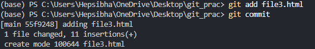

BRANCH MANAGEMENT CONTROLS
| Command | What It Does | Example | When To Use |
| -------------------------- | ------------------------------------------------------- | -------------------------------- | ---------------------------------------------------------------- |
| `git branch` | Lists all **local branches** in your repository | `git branch` | To see which branches exist and which branch you're currently on |
| `git branch -a` | Lists **all branches** (local + remote) | `git branch -a` | To see branches from GitHub / remote repo also |
| `git branch -d <branch>` | Deletes a branch **only if it is already merged** | `git branch -d feature/login` | Safe delete (prevents data loss) |
| `git branch -D <branch>` | Force deletes a branch **even if not merged** | `git branch -D feature/login` | When you are sure and want to force delete |
| `git checkout <branch>` | Switches to an existing branch | `git checkout main` | To move from one branch to another |
| `git checkout -b <branch>` | Creates a new branch AND switches to it | `git checkout -b feature/signup` | When creating a new feature branch |
| `git switch <branch>` | Switches to an existing branch (newer, clearer command) | `git switch main` | Modern alternative to checkout |
| `git switch -c <branch>` | Creates a new branch AND switches to it (modern way) | `git switch -c feature/signup` | Recommended way to create + switch |

MERGE AND INTEGRATION COMMANDS
| Feature / Aspect | `git merge <branch>` | `git merge --no-ff <branch>` |
| -------------------------- | ------------------------------------------------------ | ---------------------------------------------------------------------------------- |
| **Fast-Forward** | Allowed if main hasn’t changed → may just move pointer | Disabled → always creates a merge commit |
| **Merge Commit** | Only created if branches diverged | Always created, even if a fast-forward is possible |
| **History Appearance** | Can be linear (fast-forward) → no extra merge commit | Branch history is preserved → shows feature branch merge clearly |
| **Use Case** | Quick merges, simple projects, or small fixes | Large features, team projects, want to keep branch history visible |
| **Command Example** | `git switch main`   `git merge feature/login` | `git switch main`   `git merge --no-ff feature/login -m "Merged login feature"` |
| **Resulting Commit Graph** | Linear if fast-forward; otherwise merge commit | Merge commit always, even if linear merge possible |

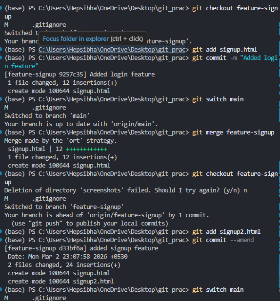
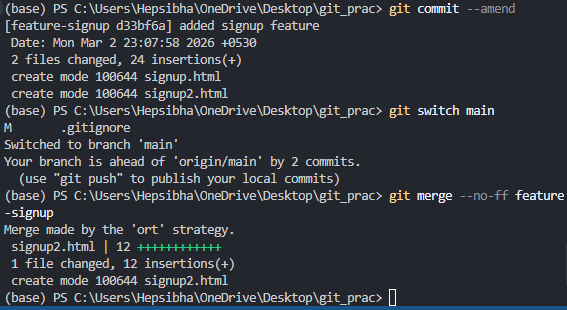

REMOTE REPOSITORY COMMANDS
| Command | What It Does | Example | When To Use |
| ----------------------------- | ------------------------------------------------------------------------- | -------------------------------------------------------------------- | --------------------------------------------------------- |
| `git remote` | Shows the names of remote repositories connected to your local repo | `git remote` → might show `origin` | Quick check of connected remotes |
| `git remote -v` | Shows remote names **and their URLs** for fetch/push | `git remote -v` → `origin  https://github.com/user/repo.git (fetch)` | To verify remote URL for push/fetch |
| `git remote add <name> <url>` | Adds a new remote repository | `git remote add upstream https://github.com/other/repo.git` | When you want to track another repo or fork |
| `git remote remove <name>` | Removes a remote from your local repo | `git remote remove upstream` | When a remote is no longer needed |
| `git fetch` | Downloads commits/branches from remote **without merging** | `git fetch origin` | To see updates on remote without affecting local branches |
| `git fetch --all` | Fetches all remotes and all branches | `git fetch --all` | Useful when multiple remotes exist |
| `git pull` | Fetches remote changes **and merges** into current branch | `git pull origin main` | To update your local branch with remote changes |
| `git pull --rebase` | Fetches remote changes and **rebases your local commits on top** | `git pull --rebase origin main` | Keeps history linear; avoids unnecessary merge commits |
| `git push` | Pushes your local commits to the remote branch | `git push origin main` | Share your commits to GitHub |
| `git push -u origin <branch>` | Pushes branch **and sets upstream** so you can later use `git push` alone | `git push | |

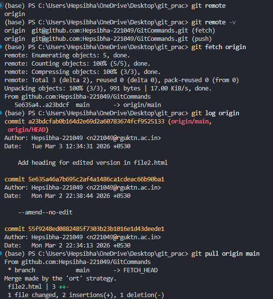
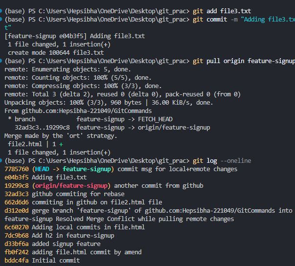
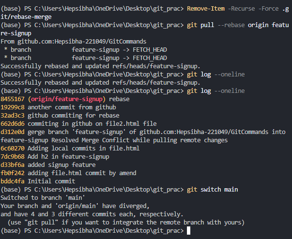

STASH COMMANDS
| Command | What It Does | Example | Result |
| --------------------------- | ----------------------------------------------------------- | --------------------------- | ------------------------------------- |
| `git stash` | Saves uncommitted changes and makes working directory clean | `git stash` | Changes are stored temporarily |
| `git stash list` | Shows all saved stashes | `git stash list` | Displays `stash@{0}`, `stash@{1}` etc |
| `git stash pop` | Restores latest stash **and deletes it** | `git stash pop` | Changes restored + stash removed |
| `git stash apply` | Restores stash but **keeps it saved** | `git stash apply` | Changes restored + stash still exists |
| `git stash apply stash@{1}` | Applies a specific stash | `git stash apply stash@{1}` | That particular stash is restored |
| `git stash drop` | Deletes a specific stash | `git stash drop stash@{0}` | Removes only that stash |
| `git stash clear` | Deletes **all** stashes permanently | `git stash clear` | All stashes removed |

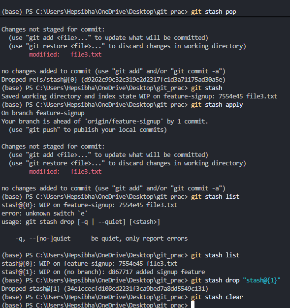

RESET AND UNDO COMMANDS
| Command | What It Does | Affects Commit History? | Affects Staging Area? | Affects Working Directory? | Example |
| ------------------- | ----------------------------------------------------- | ----------------------- | --------------------- | -------------------------- | -------------------------- |
| `git reset` | Moves HEAD to a previous commit (default = `--mixed`) | ✅ Yes | ✅ Yes (unstage files) | ❌ No | `git reset HEAD~1` |
| `git reset --soft` | Moves HEAD but keeps changes staged | ✅ Yes | ❌ No | ❌ No | `git reset --soft HEAD~1` |
| `git reset --mixed` | Moves HEAD and unstages changes (default) | ✅ Yes | ✅ Yes | ❌ No | `git reset --mixed HEAD~1` |
| `git reset --hard` | Moves HEAD and deletes all changes | ✅ Yes | ✅ Yes | ✅ Yes | `git reset --hard HEAD~1` |
| `git revert` | Creates a new commit that undoes a previous commit | ❌ No (adds new commit) | ❌ No | ❌ No | `git revert HEAD` |
| `git clean -f` | Deletes untracked files | ❌ No | ❌ No | ✅ Yes (untracked only) | `git clean -f` |
| `git clean -fd` | Deletes untracked files and folders | ❌ No | ❌ No | ✅ Yes (files + folders) | `git clean -fd` |

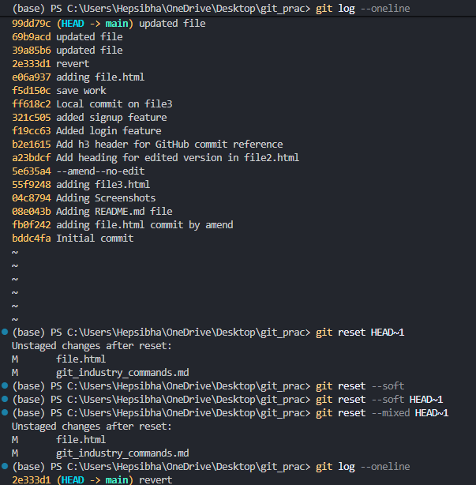
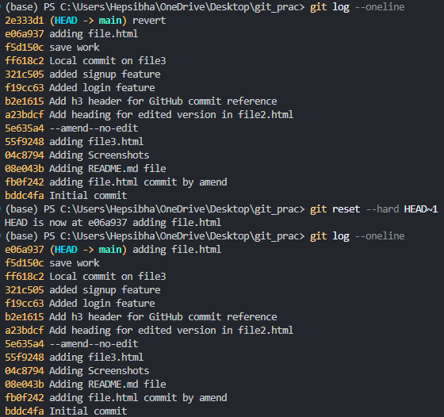
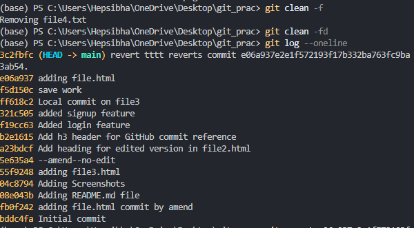

REBASING COMMANDS
| Command | What It Does | When Used |
| ----------------------- | -------------------------------------------------- | -------------------------------------- |
| `git rebase <branch>` | Moves your branch commits on top of another branch | Update feature branch with latest main |
| `git rebase -i` | Interactive rebase (edit/squash/reorder commits) | Clean commit history |
| `git rebase --continue` | Continue rebase after resolving conflicts | After fixing merge conflicts |
| `git rebase --abort` | Cancel rebase and go back to original state | If rebase goes wrong |

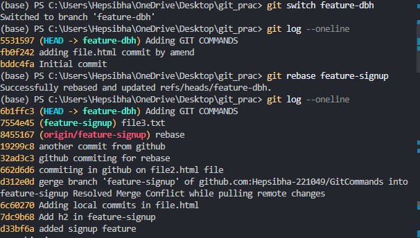
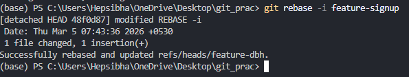

Cherry Pick & Patch Commands
| Command | Purpose | Creates Commit | Example |
| ------------------ | ------------------------------------------ | -------------- | -------------------------- |
| `git cherry-pick` | Copy a specific commit from another branch | Yes | `git cherry-pick 5a3c2b` |
| `git format-patch` | Convert commits into patch files | No | `git format-patch -1 HEAD` |
| `git apply` | Apply patch to working directory | No | `git apply fix.patch` |
| `git am` | Apply patch and create commit | Yes | `git am fix.patch` |

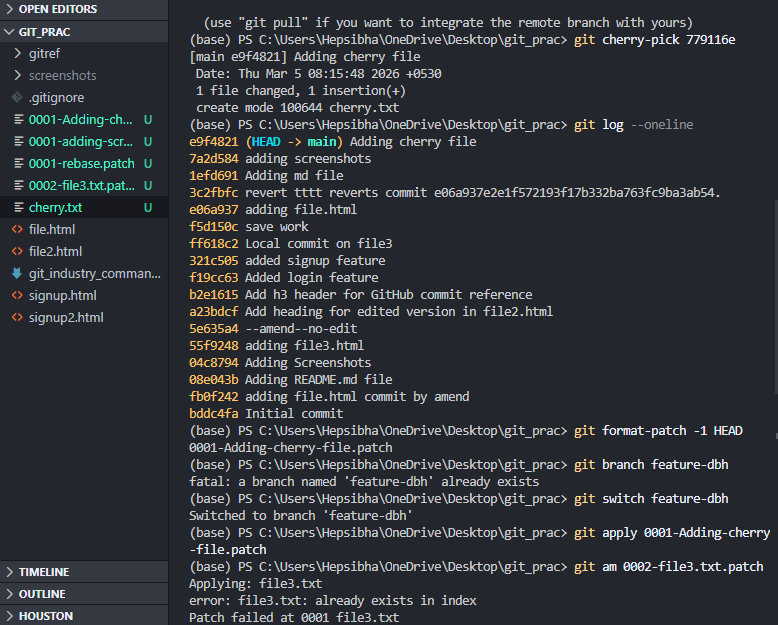

Tagging Commands
| Command | Purpose | Syntax | Example | Explanation |
| -------------------------- | ------------------------------------------------------- | ------------------------------------ | ------------------------------------ | -------------------------------------------------- |
| **git tag** | Lists all tags in the repository | `git tag` | `git tag` | Shows all existing tags in the project. |
| **git tag -a** | Creates an **annotated tag** (recommended for releases) | `git tag -a <tag-name> -m "message"` | `git tag -a v1.0 -m "First release"` | Creates a tag with author name, date, and message. |
| **git tag -d** | Deletes a tag from the **local repository** | `git tag -d <tag-name>` | `git tag -d v1.0` | Removes the tag locally (not from remote). |
| **git push origin --tags** | Pushes **all local tags** to the remote repository | `git push origin --tags` | `git push origin --tags` | Sends all tags to GitHub or remote repository. |

SUBMODULES
| Command | Purpose | Explanation | Example |
| -------------------------- | ------------------------------------- | --------------------------------------------------------------------------------------------------------------------------------------------- | -------------------------------------------------------------------- |
| **`git submodule add`** | Add another repository as a submodule | This command adds an external Git repository inside your current repository as a folder. Git stores the submodule reference in `.gitmodules`. | `git submodule add https://github.com/user/library.git libs/library` |
| **`git submodule init`** | Initialize submodules | After cloning a repository that contains submodules, this command registers the submodule URLs from `.gitmodules` into `.git/config`. | `git submodule init` |
| **`git submodule update`** | Download the submodule content | This command fetches and checks out the specific commit of the submodule that the main repository expects. | `git submodule update` |
