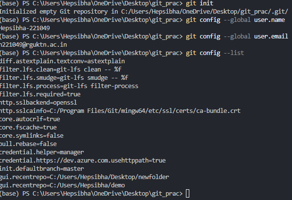
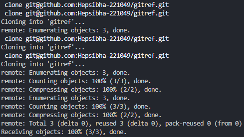
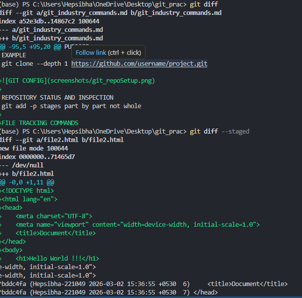
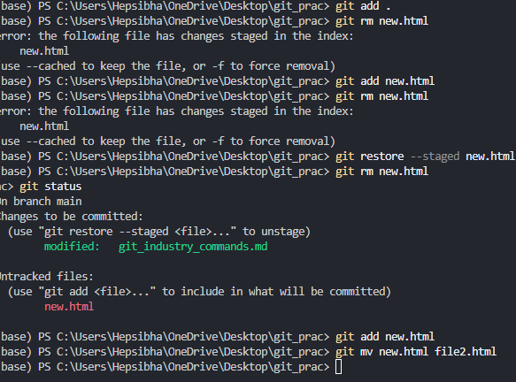
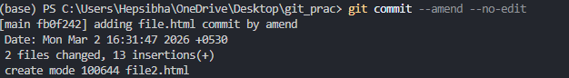
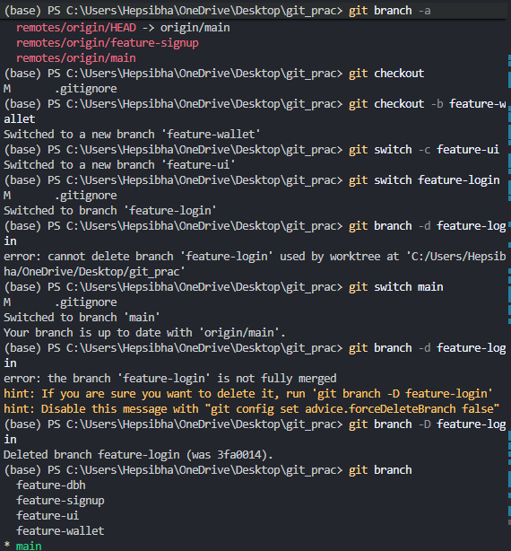

GIT CONFIGURATION COMMANDS
| ACTION | SYNTAX | PURPOSE |
| ------------------------------ | ------------------------------------------------------------ | -------------------------------------------- |
| **Set Configuration Value** | `git config [--local \| --global \| --system] <key> <value>` | Set/save a configuration value |
| **View Configuration Value** | `git config <key>` | View/display a specific configuration value |
| **List All Configurations** | `git config --list` | Display all configuration settings |
| **Remove Configuration Value** | `git config --unset <key>` | Remove/delete a specific configuration value |
| **Remove All Values of a Key** | `git config --unset-all <key>` | Remove all values associated with a key |

REPOSITORY SETUP COMMANDS
| COMMAND | SYNTAX | PURPOSE |
| ---------------------- | --------------------------------------------------- | ------------------------------------------------- |
| **GIT INIT** | `git init` | Create a new Git repository |
| **GIT CLONE** | `git clone <repository-url>` | Copy an existing remote repository |
| **GIT CLONE --BRANCH** | `git clone --branch <branch-name> <repository-url>` | Clone a specific branch |
| **GIT CLONE --DEPTH** | `git clone --depth <number> <repository-url>` | Clone with limited commit history (shallow clone) |

REPOSITORY STATUS AND INSPECTION
git add -p stages part by part not whole
| Command | Purpose |
| ------------------- | ---------------------------- |
| `git status` | Check repository state |
| `git log` | View detailed commit history |
| `git log --oneline` | Short commit history |
| `git log --graph` | Visual branch history |
| `git show` | View commit details |
| `git diff` | View unstaged changes |
| `git diff --staged` | View staged changes |
| `git blame` | See who changed each line |
| `git reflog` | View HEAD history |
| `git shortlog` | Commit summary by author |

FILE TRACKING COMMANDS
| Command | Purpose | What It Affects |
| ----------------------------- | -------------------------------------- | ----------------- |
| `git add <file>` | Stage a specific file | Working → Staging |
| `git add .` | Stage all changes | Working → Staging |
| `git add -p` | Stage changes partially (hunk by hunk) | Working → Staging |
| `git restore <file>` | Discard unstaged changes | Working Directory |
| `git restore --staged <file>` | Unstage a file | Staging Area |
| `git rm <file>` | Delete file and stage deletion | Working + Staging |
| `git rm --cached <file>` | Stop tracking file (keep locally) | Staging only |
| `git mv <old> <new>` | Rename/move file and stage change | Working + Staging |

COMMIT COMMANDS
| COMMAND | SYNTAX | DESCRIPTION |
| -------------------------------- | ------------------------------ | ------------------------------------------------------------------------------------------------- |
| **git commit** | `git commit` | Creates a new commit from staged changes and opens the default editor to write the commit message |
| **git commit -m** | `git commit -m "message"` | Creates a new commit with a message written directly in the terminal |
| **git commit --amend** | `git commit --amend` | Modifies (rewrites) the most recent commit and allows editing the commit message |
| **git commit --amend --no-edit** | `git commit --amend --no-edit` | Modifies the most recent commit but keeps the existing commit message |

BRANCH MANAGEMENT CONTROLS
| Command | What It Does | Example | When To Use |
| -------------------------- | ------------------------------------------------------- | -------------------------------- | ---------------------------------------------------------------- |
| `git branch` | Lists all **local branches** in your repository | `git branch` | To see which branches exist and which branch you're currently on |
| `git branch -a` | Lists **all branches** (local + remote) | `git branch -a` | To see branches from GitHub / remote repo also |
| `git branch -d <branch>` | Deletes a branch **only if it is already merged** | `git branch -d feature/login` | Safe delete (prevents data loss) |
| `git branch -D <branch>` | Force deletes a branch **even if not merged** | `git branch -D feature/login` | When you are sure and want to force delete |
| `git checkout <branch>` | Switches to an existing branch | `git checkout main` | To move from one branch to another |
| `git checkout -b <branch>` | Creates a new branch AND switches to it | `git checkout -b feature/signup` | When creating a new feature branch |
| `git switch <branch>` | Switches to an existing branch (newer, clearer command) | `git switch main` | Modern alternative to checkout |
| `git switch -c <branch>` | Creates a new branch AND switches to it (modern way) | `git switch -c feature/signup` | Recommended way to create + switch |

